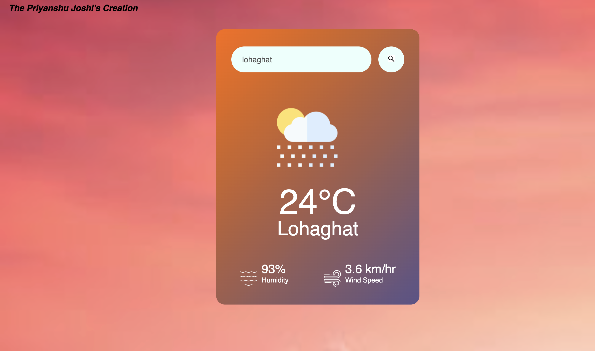

# 🌤️ Weather App

A responsive weather application built using HTML, CSS, and JavaScript that fetches real-time weather data using the WeatherAPI.

## 🚀 Features

- 🔍 Search weather by city name
- 🌡️ Real-time temperature
- 💧 Humidity
- 🌬️ Wind speed
- 🌤️ Dynamic weather icons
- ❌ Invalid city error handling
- 📱 Responsive design

## 🛠️ Technologies Used

- HTML5
- CSS3
- JavaScript (ES6)
- WeatherAPI

## 📸 Screenshot



## 📂 Project Structure

```
Weather-App/
│
├── index.html
├── style.css
├── script.js
├── README.md
└── images/
```

## 🔑 API

This project uses the WeatherAPI.

https://www.weatherapi.com/

## 👨‍💻 Author

**Priyanshu Joshi**

GitHub: https://github.com/Priyanshu789-j

## 🌐 Live Demo

https://priyanshu789-j.github.io/Weather-App/
